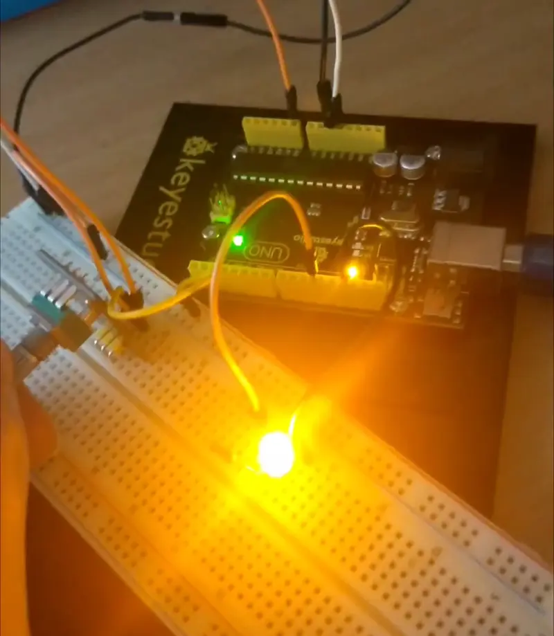

How to Use a Potentiometer with Arduino analogRead (Lesson #7) - https://www.youtube.com/watch?v=Wa8CjGsOFzY

Serial Monitor output:
```
...
3.04V (623)
3.05V (624)
3.08V (631) [622:1023] 2% = 5
3.13V (640) [622:1023] 4% = 11
3.17V (648) [622:1023] 6% = 16
3.21V (656) [622:1023] 8% = 21
3.25V (665) [622:1023] 10% = 27
3.29V (674) [622:1023] 12% = 33
3.36V (687) [622:1023] 16% = 41
3.41V (698) [622:1023] 18% = 48
3.47V (709) [622:1023] 21% = 55
3.52V (721) [622:1023] 24% = 62
3.59V (735) [622:1023] 28% = 71
3.68V (753) [622:1023] 32% = 83
3.77V (772) [622:1023] 37% = 95
3.87V (791) [622:1023] 42% = 107
3.94V (807) [622:1023] 46% = 117
4.02V (822) [622:1023] 49% = 127
4.09V (836) [622:1023] 53% = 136
4.20V (859) [622:1023] 59% = 150
4.35V (889) [622:1023] 66% = 169
4.49V (919) [622:1023] 74% = 188
4.66V (953) [622:1023] 82% = 210
4.82V (987) [622:1023] 91% = 232
5.00V (1023) [622:1023] 100% = 255
5.00V (1023)
5.00V (1023)
...
```
