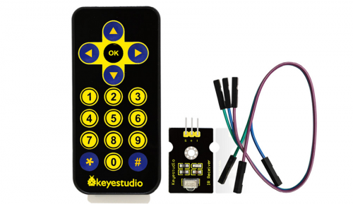

KS0088 IR remote:



Serial Monitor output:
```
START C:\dan\dev\@Arduino\Study\14-remote_control_ir\14-remote_control_ir.ino from Aug  6 2024
Using library version: 4.4.0
Ready to receive IR signals of protocols: NEC/NEC2/Onkyo/Apple, at pin: 11

Protocol=NEC Address=0x0 Command=0x40 Raw-Data=0xBF40FF00 32 bits LSB first
'OK'
Protocol=NEC Address=0x0 Command=0x46 Raw-Data=0xB946FF00 32 bits LSB first
'Up'
Protocol=NEC Address=0x0 Command=0x16 Raw-Data=0xE916FF00 32 bits LSB first
'1'
Protocol=NEC Address=0x0 Command=0x16 Repeat gap=39450us
'1'
Protocol=NEC Address=0x0 Command=0x52 Raw-Data=0xAD52FF00 32 bits LSB first
'0'
Protocol=NEC Address=0x0 Command=0x42 Raw-Data=0xBD42FF00 32 bits LSB first
'*'
Protocol=NEC Address=0x0 Command=0x4A Raw-Data=0xB54AFF00 32 bits LSB first
'?'
Protocol=NEC Address=0x0 Command=0x4A Repeat gap=39450us
'?'
```
